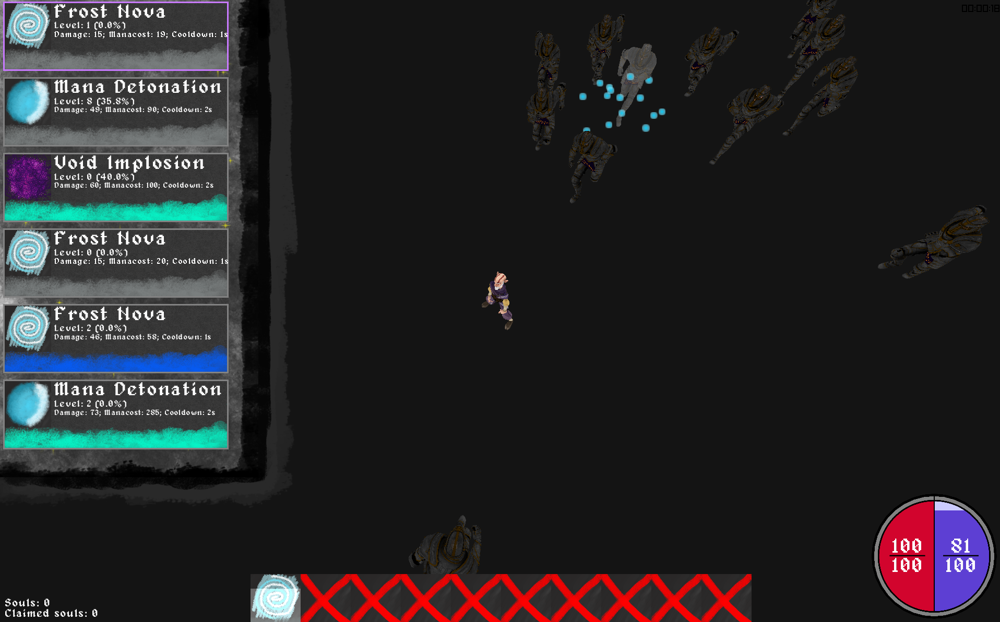

## Basic controls
Pressing escape will go back in the menus and pause the game. To bring up the spellbook press b, otherwise movement is WASD and casting spells is done via the number keys 1-9,0 (in that order). To equip a spell either drag it from the spellbook to the slot or while hovering over the spell press a number key which corresponds with the spell slot.
## Building
If you're on NixOS or are using Nix, just run `nix run .#default` to launch the game.
When launching make sure you're in the project root dir or in any directory with the ./assets directory in it.
